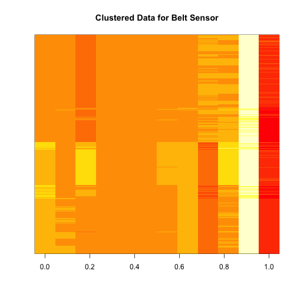

Report - Practical Machine Learning Project
========================================================
author: Edilmo Palencia
date: 11/20/2015

Final Results

Introduction
========================================================

A model to classify the Unilateral Dumbbell Biceps Curl was built.  

Six participants were asked to perform one set of 10 repetitions of the Unilateral Dumbbell Biceps Curl in five different fashions: 

- Class A: exactly according to the specification
- Class B: throwing the elbows to the front.
- Class C: lifting the dumbbell only halfway.
- Class D: lowering the dumbbell only halfway.
- Class E: throwing the hips to the front.


Hypothesis
========================================================

**The presence of one movement can be detected with a specific subset of measures in a specific subset of sensors.**

In order to validated this hypothesis a [Shiny application](https://edilmo.shinyapps.io/PracticalMachineLearningCP) was built to run some exploratory analysis.  
This application allows to perform:
- Cluster analysis: using k-means
- Dimensionality analysis: using PCA


Cluster analysis example
========================================================

```r
kmeansBelt <- kmeans(train[,tempNames[grep("_belt", tempNames)]], centers = 5)
image(t(train[,tempNames[grep("_belt", tempNames)]])[, order(kmeansBelt$cluster)], yaxt = "n", main = "Clustered Data for Belt Sensor")
```

 


Results
========================================================

The final results of the model over the Test Set are shown in the following table:  

Test Set | Sensitivity | Specificity | Balanced Accuracy
---------|------------ |------------ | -----------------  
Class: A |   0.9779541 |   0.9974901 |         0.9877221  
Class: B |   0.9772423 |   0.9908690 |         0.9840557  
Class: C |   0.9486448 |   0.9941030 |         0.9713739  
Class: D |   0.9789644 |   0.9885023 |         0.9837333  
Class: E |   0.9903181 |   0.9984375 |         0.9943778  

The final accuracy over the validation set was 0.9755289
